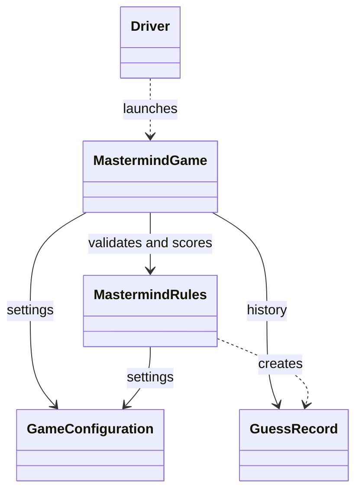
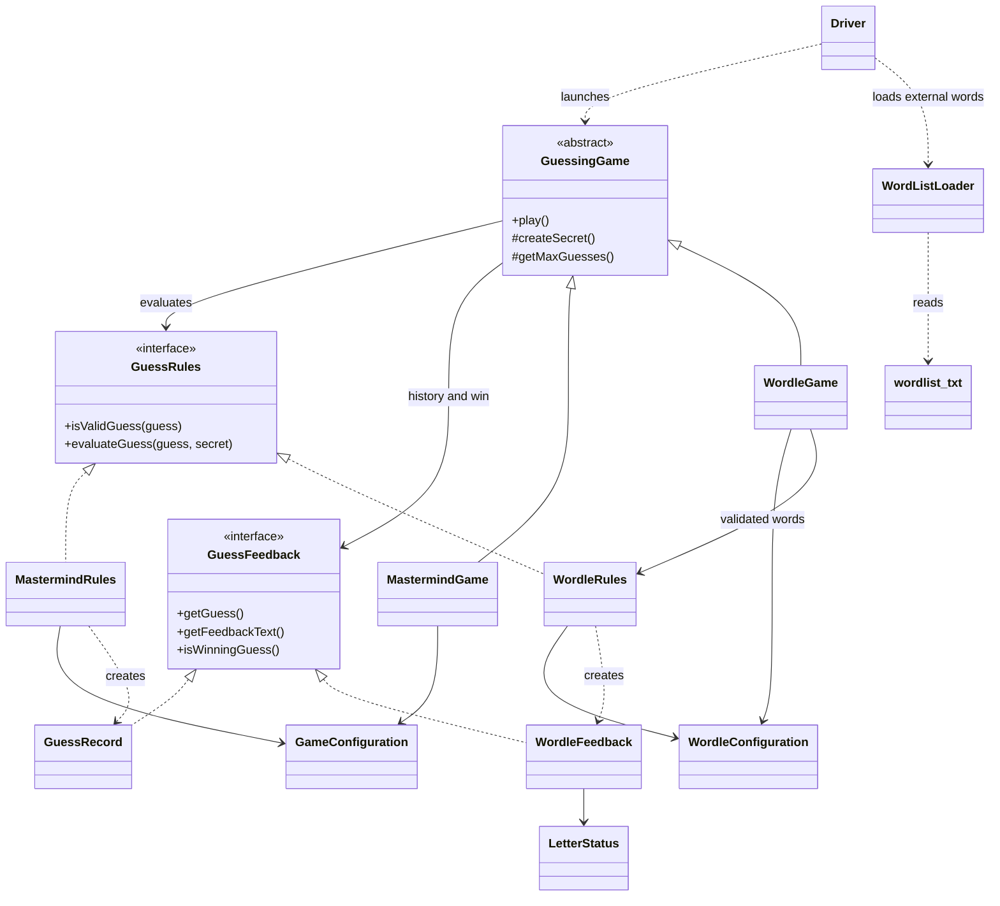

# Architecture Change Report

ECE 422C - Project 2, Phase II | EID: au4355

## Starting point and scope

This is an extension of the existing repository, not a replacement project. The original tracked Phase I implementation has Driver, MastermindGame, MastermindRules, GuessRecord, GameConfiguration, and MasterMindRulesTest. At the start of the Phase II request, the working tree already included the shared-loop refactoring completed during the preceding Phase I repair. The report distinguishes that earlier refactoring from changes made specifically for Wordle.

The original tracked source and project2_au4355.zip remain available. The working source immediately before Wordle was also saved as phase1_snapshot/Phase1_before_Wordle.zip with SHA-256 hashes. This snapshot records the actual local starting point; it does not claim to verify which files were uploaded to a course system.

## 1. Which Phase I types were reused unchanged?

Relative to the working snapshot before Wordle, GuessRules, GuessFeedback, GuessingGame, MastermindGame, MastermindRules, and GameConfiguration are byte-for-byte unchanged. The original MasterMindRulesTest and the Phase I TestHarness are also unchanged. They exercise the same Mastermind algorithm and behavior after the extension.

Relative to the original tracked Phase I source, MasterMindRulesTest is unchanged. The shared interfaces and base class did not yet exist in that tracked version. Calling them unchanged original-submission types would obscure the earlier refactoring.

## 2. Which Phase I types were modified, and why?

During the Wordle extension, Driver gained game selection, external dictionary loading, and readable dictionary errors. It constructs either game through a GuessingGame reference and calls the same play method. GuessRecord regained its original three-argument constructor as an overload so existing Phase I callers remain source-compatible; the four-argument constructor still supplies the code length explicitly for scoring.

Earlier, while repairing the working Phase I code, MastermindGame was changed to extend GuessingGame. Its turn loop, history, attempt accounting, and replay moved into that superclass. The subclass retained secret generation, configuration, and Mastermind wording. MastermindRules implemented GuessRules and passed code length to GuessRecord; its two-pass scoring algorithm was retained. GuessRecord implemented GuessFeedback and added game-independent feedback and win methods while keeping its original accessors.

GameConfiguration also received Locale.ROOT normalization and rejection of symbols whose uppercase conversion expands their length. Those validation fixes preceded Wordle and do not mix Wordle settings into Mastermind configuration.

## 3. Which new types are Wordle-specific?

WordleConfiguration validates word length and maximum attempts (defaults: 5 and 6). WordListLoader reads UTF-8 external data, normalizes case, removes duplicates while retaining order, filters by length, and reports malformed or unusable files. WordleRules validates dictionary membership and calculates ordered letter feedback. WordleFeedback is an immutable result with a nested LetterStatus enum: CORRECT, PRESENT, and ABSENT. WordleGame supplies dictionary-based secret generation, settings, and prompts to the shared runner. WordleRulesTest covers Wordle behavior and both launch paths.

wordlist.txt contains the exact 50-word list supplied by the user. It is external data, not a Java constant. The same allowed list is used for guesses and secrets; the specification does not require separate lists.

## 4. Which abstractions were too Mastermind-specific?

The original GameConfiguration contains legalColors and codeLength, so it remains intentionally Mastermind-specific despite its broad name. WordleConfiguration avoids irrelevant color settings. GuessRecord stores black/white peg counts; reusing it for Wordle would discard per-position information. WordleFeedback supplies that information through the same small result interface.

The original MastermindGame was a console runner coupled directly to MastermindRules and GuessRecord. That coupling, rather than the scoring algorithm, was the main obstacle to reuse. The original win method also required the caller to know the Mastermind code length. The parameterless GuessFeedback.isWinningGuess removes that knowledge from the runner.

## 5. What refactoring improved reuse or separation?

Extracting GuessingGame made one class responsible for the complete interaction lifecycle: prompt, command normalization, validation, attempts, history, win/loss, and replay. It delegates evaluation to GuessRules and stores only GuessFeedback results. History calls getGuess and getFeedbackText, so it does not rely on a particular result class or toString format.

WordleGame contains no second turn loop. Its createSecret chooses from validated words; its hooks provide the attempt limit and game-specific prose. Driver owns file loading, while WordleRules works with an in-memory collection. This lets unit tests supply small fixtures without involving console input or production files.

## 6. Did supporting both games add complexity, and was it worthwhile?

Two interfaces and an abstract runner introduce indirection. The five runner hooks are getMaxGuesses, createSecret, secretNoun, invalidGuessMessage, and printIntroduction. That complexity was worthwhile because the validation/attempt/history/replay behavior now has one implementation. The interfaces remained unchanged when Wordle was added, which demonstrates actual substitution.

The runner still owns Scanner and Random and writes to System.out. That is suitable for these two console games, but a graphical interface would benefit from injected input/output boundaries. No generic framework or separate configuration superclass was added just to combine two small configuration records.

## 7. What would change if Wordle had been known earlier?

GameConfiguration would have been named MastermindConfiguration, and GuessRecord would have been named MastermindFeedback. The initial runner would have depended on GuessRules and GuessFeedback from the outset. These names and boundaries would have made the game-specific pieces easier to recognize and avoided moving the console loop later.

The present scope still does not justify predicting every future game. Uppercase string guesses, a reserved HISTORY command, and English A-Z dictionary entries match these games and the supplied dictionary. A future case-sensitive or non-console game would require revisiting those assumptions. When using a seven-letter Wordle configuration, HISTORY remains a reserved command rather than a playable guess.

## 8. Before-and-after class/interface diagrams

Before: original tracked Phase I implementation. The immediately-pre-Wordle working snapshot already contained GuessingGame, GuessRules, and GuessFeedback from the refactoring described above.

After: both concrete games share the same runner and contracts.

Validation: all 561 checks pass, including 256 retained Mastermind checks and 305 Wordle/launch checks. No external grading service was used.
